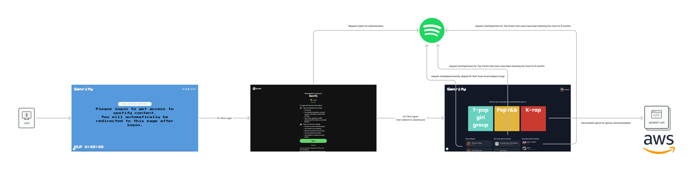

# Genrify

This project is Genrify, genre recommendation system. It is built using Next.js and integrates with the backend API to provide genre recommendations based on user listening habits. This project helps users discover new categories using their individually created categories, and institutionally created category that created by music industry merged with computationally-created categories.

## Features

- User authentication with Spotify
- Display recent plays and top tracks
- Fetch and display genre recommendations

## Architecture
This is the architecture of the website.
- The frontend is built using React x Next.js
- The backend is built using Python x Flask
- I host the backend on AWS and the frontend on Vercel 



## Demo
1) In case, Spotify hasnt approved my website yet, please notify me to add your spotify account to the list of authorized users, provide me with your 'Name' and your Email address that associated with your Spotify account.
2) Go to [Genrify](https://genrify-music.vercel.app/)
3) In case you dont have a Spotify account
[Watch the Demo Here!!!!](https://www.youtube.com/watch?v=UIuXdLXOaOM)


## Requirements

- Node.js
- npm or yarn

## Installation

1. Clone the repository
2. Navigate to the project directory:
   ```sh
   cd genrify-frontend
   ```

3. Install the dependencies:
   ```sh
   npm install
   # or
   yarn install
   ```

## Usage

1. Run the development server:
   ```sh
   npm run dev
   # or
   yarn dev
   ```

2. Open [http://localhost:3000](http://localhost:3000) with your browser to see the result.

You can start editing the page by modifying `src/app/page.tsx`. The page auto-updates as you edit the file.

## Learn More

To learn more about Next.js, take a look at the following resources:

- [Next.js Documentation](https://nextjs.org/docs) - learn about Next.js features and API.
- [Learn Next.js](https://nextjs.org/learn) - an interactive Next.js tutorial.

You can check out [the Next.js GitHub repository](https://github.com/vercel/next.js) - your feedback and contributions are welcome!

## Deploy on Vercel

The easiest way to deploy your Next.js app is to use the [Vercel Platform](https://vercel.com/new?utm_medium=default-template&filter=next.js&utm_source=create-next-app&utm_campaign=create-next-app-readme) from the creators of Next.js.

Check out our [Next.js deployment documentation](https://nextjs.org/docs/app/building-your-application/deploying) for more details.